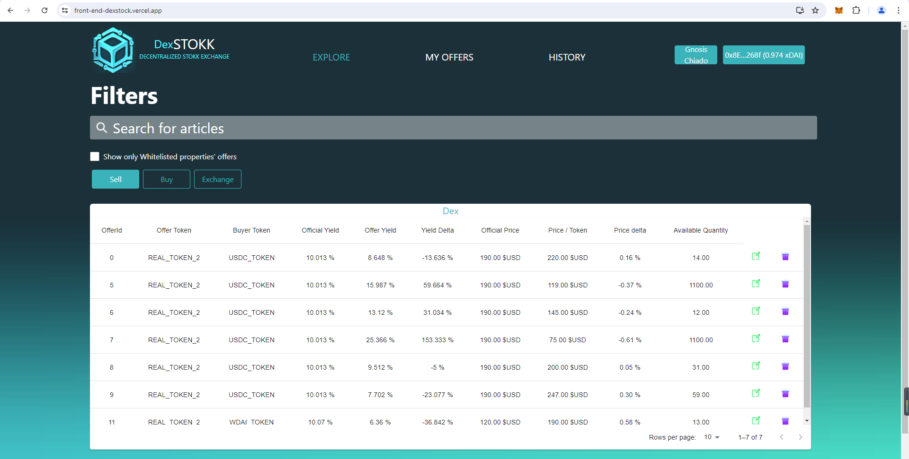
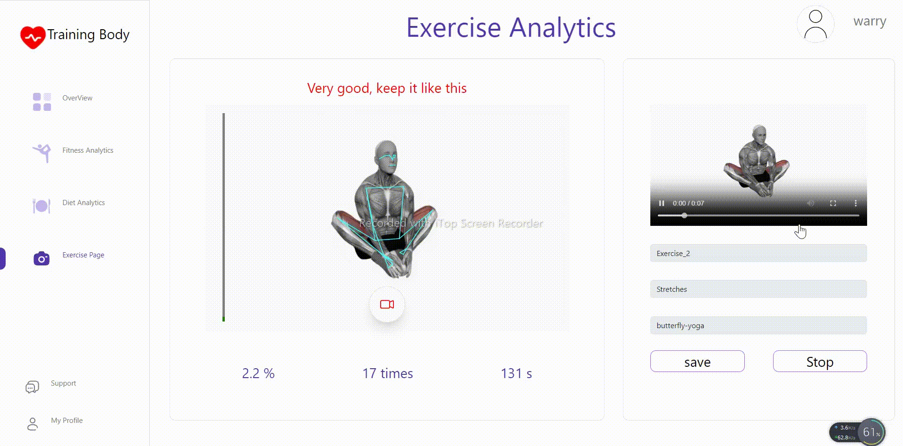

<!--suppress HtmlDeprecatedAttribute -->
<h1 align="center">
    Full Stack Ethereum | Solana Developer
      
    <b></b>
</h1>

- 🔭 MERN Stack Expert with 4+ years in React and Node.JS 
- 🎸Blockchain Developre with 6+ years for Solana and Ethereum
 

<table>
  <tr>
    <td align = "center">    
            
    </td>
  </tr>
  <tr>
    <td align = "center">    
            
    </td>
  </tr>

  <tr>
    <td align = "center">    
      
    </td>
  </tr>

  <tr>
    <td align = "center">    
      
    </td>
  </tr>

</table>

# Main Skills #

