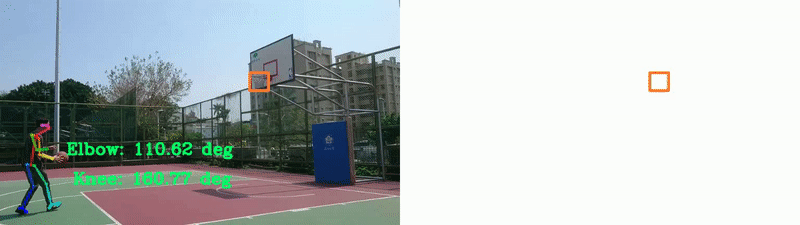

<!--suppress HtmlDeprecatedAttribute -->
<h1 align="center">
    Hello   
    <b>Web Developer with Node.js and Next.js</b>
</h1>

 

 

- 🔭 MERN Stack Expert with 4+ years in React and Node.JS 
- 😍 Computer Vision Engineer with 6+ years with OpenCV and CNN.
- 😉 Deep knowledge about deep learning, machine learning and reinforcement system. 

# My Certification #

</img> 

<table>
  <tr>
    <td align = "center">    
      
    </td>
  </tr>
  <tr>
    <td align = "center">    
      
    </td>
  </tr>
  <tr>
    <td>    
      
      
    </td>
  </tr>
    <tr>
    <td align = "center">    
      
    </td>
  </tr>
  <tr>
    <td align = "center">    
      
    </td>
  </tr>
  <tr>
    <td>    
      
    </td>
  </tr>
  <tr>
    <td align="center">    
      
    </td>
  </tr>  
</table>

# Main Skills #

<!--

-->

<!-- activity graph heroku-app start -->

    

<!-- activity graph heroku-app end -->

