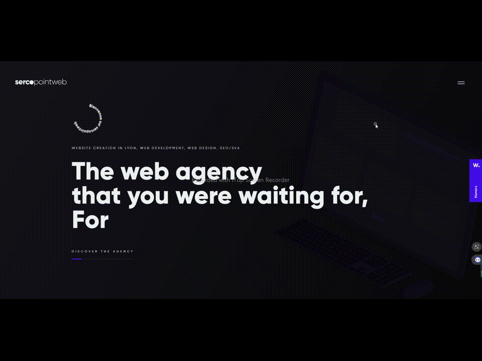

<!--suppress HtmlDeprecatedAttribute -->
<h1 align="center">
    Hello   
    <b>Computer Vision && Web Developer</b>
</h1>

 

 

- 🔭 MERN Stack Expert with 4+ years in React and Node.JS 
- 😍 Computer Vision Engineer with 6+ years with OpenCV and CNN.
- 😉 Deep knowledge about deep learning, recommendation system and reinforcement system. 

# My Certification #

</img> 

# Main Skills #

# 💻 My favorite tools and technologies

<table align="center">
  <tr>
    <td align="center" width="96">
        
       React
    </td>
    <td align="center" width="96">
      
       Python
    </td>
    <td align="center" width="96">
        
       JavaScript
    </td>
    <td align="center" width="96">
        
       C++
    </td>
    <td align="center" width="96">
        
       MySQL
    </td>
    <td align="center" width="96">
        
       TypeScript
    </td>
    <td align="center" width="96">
        
       AWS
    </td>
    <td align="center" width="96">
        
       C#
    </td>
  </tr>
  <tr>
  <td align="center" width="96">
        
       Django
    <td align="center" width="96">
        
       Github
    </td>
    <td align="center" width="96"> 
        
       Git
    </td>
    <td align="center"  width="96">
        
       Laravel
    </td>
    <td align="center"  width="96">
        
       HTML5
    </td>
    <td align="center" width="96">
        
       CSS
    </td>
    <td align="center"  width="96">
        
       Bootstrap
    </td>
    <td align="center" width="96">
        
       Tailwind
    </td>
    <td align="center" width="96">
        
       jQuery
    </td>
  </tr>
 <tr>
      <td align="center" width="96">
        
       MongoDB
    </td>
        <td align="center" width="96">
        
       Nodejs
      </td>
    <td align="center" width="96">
        
       PHP
    </td>
    <td align="center" width="96">
        
       VsCode
    </td>
    <td align="center" width="96">
        
       WordPress
    </td>
    <td align="center" width="96">
        
       GraphQL
    </td>

 </tr>
</table>
  

<!--

-->

<!-- activity graph heroku-app start -->

    

<!-- activity graph heroku-app end -->

<table>
  <tr>
    <td align = "center">    
      
    </td>
  </tr>
  <tr>
    <td align = "center">    
      
    </td>
  </tr>
  <tr>
    <td>    
      
      
    </td>
  </tr>
    <tr>
    <td align = "center">    
      
    </td>
  </tr>
  <tr>
    <td align = "center">    
      
    </td>
  </tr>
  <tr>
    <td>    
      
    </td>
  </tr>
  <tr>
    <td align="center">    
      
    </td>
  </tr>  
  <tr>
    <td>    
      
    </td>  
  </tr>
</table>

# Welcome!

## My personal values and work ethic

✨ I want to build strong relationships with my clients.

✨ I believe that a good working relationship is built on mutual trust and respect.

✨ I value open communication and strive to keep you updated on progress every step of the way.

✨ I am a team player and enjoy collaborating with others to achieve a common goal.

✨ Outside of work, I am an avid sports fan, especially when it comes to football.

✨ I enjoy learning new technologies and am constantly seeking opportunities to expand my skillset.

✨ Preferred PHP frameworks 
    
    ✔Laravel
    ✔Codeigniter 
    ✔Sympony 
    ✔Yii
       
✨ Preferred Python frameworks   
    
    ✔Python 
    ✔Django 
    ✔Flask
          
✨ Preferred JS frameworks   
    
    ✔TypeScript 
    ✔Next.js 
    ✔React.js 
    ✔Vue.js
         
✨ Preferred style frameworks    
    
    ✔Tailwind CSS 
    ✔Bootstrap 
    ✔Material-UI
         
✨ Database options   
    
    ✔MongoDB 
    ✔MySQL 
    ✔PostgreSQL 
    ✔MSSQL
         
✨ Preferred CMS Platform   

    ✔WordPress 
    ✔Shopify 
    ✔WIx 
    ✔Squarespace 
    ✔bubble.io
         
✨ Web hosting options    

    ✔ Azure service   
    ✔ AWS Services - EC2, S3, and Lambda    
    ✔ cPanel service 
    ✔GoDaddy
         
✨ Payment gateway integration  

    ✔Stripe 
    ✔PayPal
        

   

   

## Rapidfire  
<table><tr><td valign="top" width="100%">

- 🔭 I’m currently working on [Business Website Deveopment](https://github.com/happyday1996)  
  

- 🌱 I’m currently building business websites using Next.js, Typescript, Tailwind CSS.  
  

- ❓ Ask me about anything related to MERN stack and related technologies  
  

- ⚡ Fun fact: I keep night shift swithed on at all times   

</td></tr></table>  

   

## Languages and Tools  

  
  
  
  
  
  
  
  
  
  
  
  
  
  
  
  
  
  
  
  
  
  
  
  
  
  
  
  
  
  
  
  
  
  
  
  
  
  
  
  
  
  
  
  
  
  
  
  
  
  
  
  
  
  
  
  
  
  
  
  
  
  
  
  
  

  

   

# 📊 GitHub Stats:
 
 

### 🏆 GitHub Trophies

   

